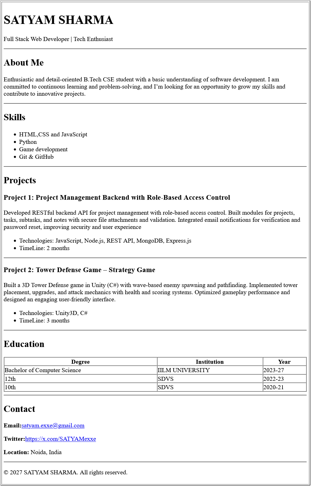

# Resume Project - Beginner's Guide

A simple, semantic HTML resume project built using pure HTML5 semantic tags.

## 📸 Preview

Here's what the resume looks like:



## 📚 What I Learned

In this project, I learned about:

1. **Semantic HTML5 Tags**: Understanding the difference between semantic and non-semantic HTML
   - `<header>` - For the top section with name and title
   - `<main>` - For the main content area
   - `<section>` - For organizing different parts of the resume
   - `<article>` - For individual projects
   - `<table>`, `<thead>`, `<tbody>` - For structured data like experience and education
   - `<address>` - For contact information
   - `<footer>` - For the copyright notice
   - `<hr>` - For visual separators between sections

2. **HTML Structure**: How to organize content logically using proper HTML structure

3. **Accessibility**: Semantic tags help screen readers and improve website accessibility

4. **Best Practices**: Writing clean, readable HTML code without inline styles

## 🚀 Project Steps

Here's what I did to create this resume:

### Step 1: Set Up the Basic HTML Structure
- Created an `index.html` file
- Added the basic HTML5 document structure with `<!DOCTYPE html>`
- Included essential meta tags for character encoding and viewport

### Step 2: Added Semantic Sections
- Created a `<header>` section with name and title
- Added a `<main>` section to contain all resume content
- Organized content into logical `<section>` elements:
  - About Me
  - Skills (using `<ul>` and `<li>`)
  - Experience (using `<table>`)
  - Projects (using `<article>`)
  - Education (using `<table>`)
  - Contact (using `<address>`)

### Step 3: Added Content
- Filled in all sections with appropriate content
- Used proper heading hierarchy (`<h1>`, `<h2>`, `<h3>`)
- Added horizontal rules (`<hr>`) to separate sections

### Step 4: Added Footer
- Created a `<footer>` section with copyright information

## 💻 How to Run Locally

Follow these simple steps to view the resume on your computer:

### Method 1: Using a Web Browser (Easiest)

1. **Open the file directly:**
   - Navigate to the project folder on your computer
   - Double-click on `index.html`
   - It will open in your default web browser

2. **Or drag and drop:**
   - Open your web browser (Chrome, Firefox, Safari, etc.)
   - Drag the `index.html` file into the browser window

### Method 2: Using a Local Server (Recommended for Learning)

 **Using VS Code Live Server extension:**
   - Install the "Live Server" extension in VS Code
   - Right-click on `index.html`
   - Select "Open with Live Server"

## 📤 How to Push to GitHub

Here's a step-by-step guide to push your project to GitHub:

### Prerequisites
- Make sure Git is installed on your computer
- Create a GitHub account (if you don't have one)

### Step 1: Initialize Git Repository

Open your terminal/command prompt and navigate to your project folder:


Initialize a Git repository:

```bash
git init
```

### Step 2: Create .gitignore File (Optional but Recommended)

Create a `.gitignore` file to exclude unnecessary files:

```bash
# Create .gitignore file
touch .gitignore
```

Add these lines to `.gitignore`:
```
.DS_Store
*.log
```

### Step 3: Add Files to Git

Add all your files to Git:

```bash
git add .
```

Or add specific files:

```bash
git add index.html
git add README.md
```

### Step 4: Make Your First Commit

Commit your changes with a message:

```bash
git commit -m "HTML resume"
```

### Step 5: Create a GitHub Repository

1. Go to [GitHub.com](https://github.com) and sign in
2. Click the "+" icon in the top right corner
3. Select "New repository"
4. Name your repository (e.g., "resume" or "my-resume")
5. **Don't** initialize with README, .gitignore, or license (we already have files)
6. Click "Create repository"

### Step 6: Connect Local Repository to GitHub

```bash
# Add the remote repository
git remote add origin https://github.com/YOUR_USERNAME/YOUR_REPO_NAME.git

# Rename the branch to main (if needed)
git branch -M main

# Push your code to GitHub
git push -u origin main
```

### Step 7: Verify on GitHub

1. Go to your GitHub repository page
2. You should see your `index.html` and `README.md` files
3. To view the resume, go to Settings → Pages → Select "main" branch → Save
4. Your resume will be live at: `https://YOUR_USERNAME.github.io/YOUR_REPO_NAME/`

## 📁 Project Structure

```
Resume/
│
├── index.html          # Main HTML file with resume content
└── README.md           # This file - project documentation
```

## 🤝 Contributing

This is a learning project, but feel free to:
- Fork the repository
- Make improvements
- Share your version


**Happy Coding! 🎉**

If you have questions or need help, don't hesitate to ask or search for tutorials online. Everyone starts as a beginner!