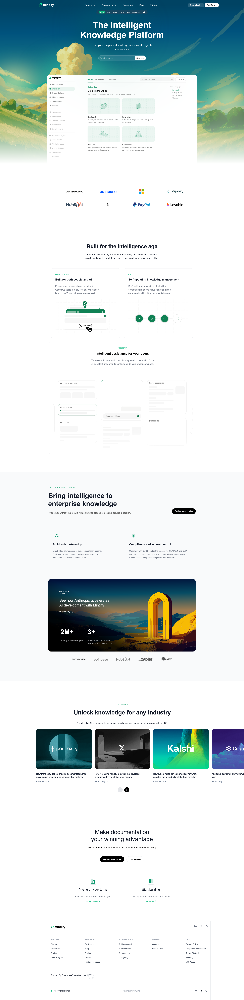

# Mintlify Landing Page Clone

This project is a static landing page clone inspired by the Mintlify website.  
It is built using pure HTML and CSS to practice modern UI layout, styling, and component-based page structure.

---

---

## 🚀 Tech Stack

- **HTML5** – Structure and semantic layout  
- **CSS3** – Styling, layout, grid, flexbox, and animations  
- **Font Awesome** – Icons  
- **SVG, Images & Videos** – Visual assets and demos  

---

## ✨ Features

- Sticky navigation bar with blur effect  
- Hero section with call-to-action input  
- Customer logos grid  
- Feature sections with embedded videos  
- Enterprise-focused section with cards  
- Customer stories slider layout (static)  
- Call-to-action section  
- Detailed footer with social links and theme buttons  

---

## 📁 Project Structure

├── index.html\
├── style.css\
├── assets/

---

## ▶️ How to Run the Project

1. Clone or download the repository  
2. Ensure the `assets` folder is in the same directory  
3. Open `index.html` in any modern web browser  

---

## 📝 Notes

- This is a **frontend-only** project (no JavaScript or backend).
- The page is mainly built for **learning UI design and CSS layout**.
- Responsiveness is partial and can be improved further.

---

## 📌 Purpose

This project was created to understand:
- Real-world landing page structure  
- CSS positioning, grid, and flexbox  
- Component-based UI layout  
- Modern website design patterns  

---

